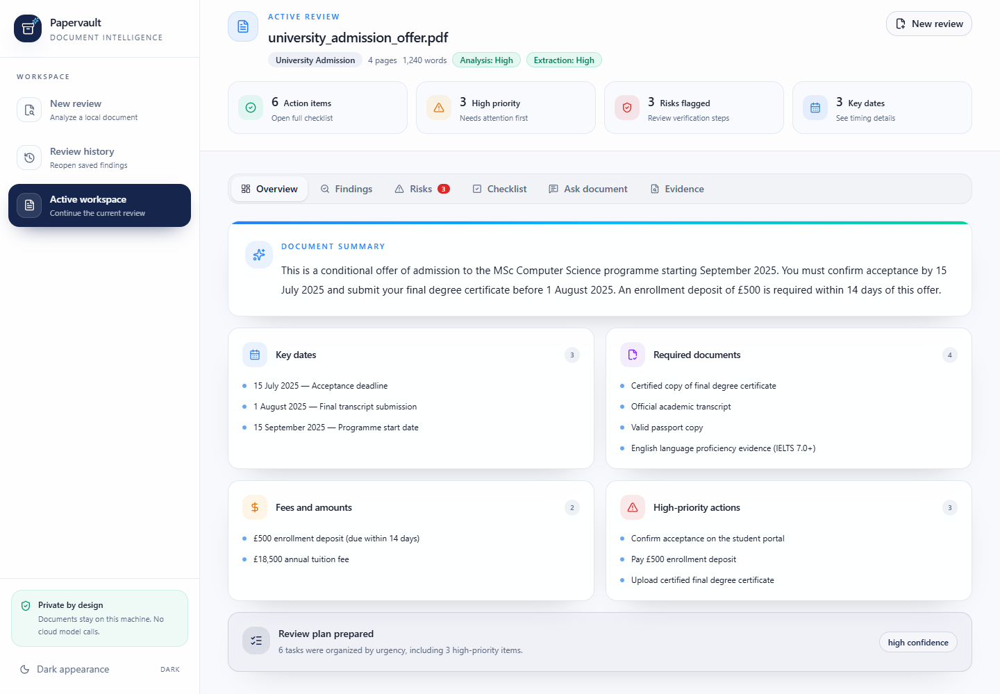
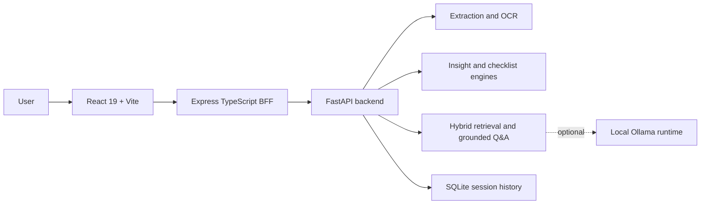

<div align="center">
  

  <h1>Papervault</h1>

  <p><strong>Private document intelligence for turning dense files into clear, actionable work.</strong></p>

  <p>
    Extract content, identify deadlines and risks, prepare checklists, ask grounded questions,
    and export structured reviews without sending documents to a cloud service.
  </p>

  <p>
    <a href="https://github.com/noumanshahid-1/-Papervault-Private-AI-Document-Intelligence/actions/workflows/backend.yml">
      
    </a>
    <a href="https://github.com/noumanshahid-1/-Papervault-Private-AI-Document-Intelligence/actions/workflows/frontend.yml">
      
    </a>
    <a href="https://github.com/noumanshahid-1/-Papervault-Private-AI-Document-Intelligence/actions/workflows/server.yml">
      
    </a>
  </p>

  <p>
    
    
    
    
    
  </p>
</div>

---



## Overview

Papervault is a local-first workspace for reviewing PDFs, images, DOCX files,
Markdown, and plain text. It combines deterministic extraction, OCR, structured
document analysis, hybrid retrieval, and explainable question answering in one
responsive interface.

The application is designed for documents where missing a date, payment,
supporting record, or obligation can have real consequences:

- University offers and scholarship letters
- Official notices and government forms
- Visa and immigration documents
- Contracts, invoices, and supporting records
- Scanned correspondence and image-based documents

## What it delivers

| Capability | Result |
|---|---|
| Multi-format extraction | Reads PDF, DOCX, TXT, MD, PNG, and JPG files |
| OCR fallback | Uses Tesseract or RapidOCR when direct text extraction is insufficient |
| Structured findings | Surfaces dates, deadlines, fees, documents, duties, contacts, and risks |
| Priority analysis | Explains why findings are marked high, medium, or low priority |
| Action planning | Converts findings into a persistent, filterable checklist |
| Grounded Q&A | Answers from retrieved source evidence with citations and confidence details |
| Retrieval diagnostics | Reports providers, ranking scores, matched terms, and relevance warnings |
| Quality feedback | Shows extraction confidence, OCR quality, and scan-improvement guidance |
| Local history | Stores privacy-conscious session summaries in SQLite |
| Report export | Produces Markdown and JSON review reports |
| Responsive workspace | Supports desktop, tablet, and mobile layouts down to 320px |

## Product highlights

### Privacy by design

Uploaded originals are processed locally and are not persisted by the
application. Saved history stores a text fingerprint and structured results by
default, with source snippets removed. Full extracted-text retention is an
explicit opt-in setting.

### Explainable results

Papervault does more than return an answer. It exposes:

- The evidence snippets used
- Retrieval relevance and score spread
- Matched question and document terms
- Extraction and analysis confidence
- The strategy used to select the answer
- Limitations and recommended verification steps

### Strong extractive Q&A

The default Q&A pipeline works without a local language model. Evidence is
ranked using a dependency-free combination of vector similarity, lexical
coverage, and document-review intent. Targeted extractive rules distinguish
between details such as programme start dates, acceptance deadlines, required
documents, payment obligations, and contact information.

A cached sentence-transformer and FAISS can improve semantic retrieval when
available. Ollama remains an optional local generator rather than a runtime
requirement.

### Contract-driven frontend

FastAPI schemas are the source of truth for API contracts. The repository
exports OpenAPI, derives raw TypeScript types, and maps transport responses into
focused frontend view models. CI checks prevent backend and frontend contracts
from silently drifting apart.

## Architecture



The Node.js layer is intentionally thin. It handles CORS, uploads, and HTTP
proxying while all document-processing logic remains in the Python backend.

## Technology

| Layer | Stack |
|---|---|
| Frontend | React 19, TypeScript 6, Vite 8, Tailwind CSS 4, shadcn/ui, Zustand, TanStack Query, React Router |
| BFF | Node.js, Express, TypeScript, multer, native FormData and Blob |
| Backend | Python 3.11, FastAPI, uvicorn, Pydantic 2 |
| Extraction | PyMuPDF, pdfplumber, python-docx, pytesseract, RapidOCR |
| Retrieval | sentence-transformers when cached, deterministic hashing fallback, FAISS when available |
| Storage | SQLite |
| Validation | pytest, Vitest, ESLint, TypeScript, Vite production build, OpenAPI freshness checks |

## Quick start

### Requirements

- Node.js 18 or newer
- Python 3.11
- Tesseract is optional; RapidOCR provides a local fallback
- Ollama is optional

### Install

```bash
git clone https://github.com/noumanshahid-1/-Papervault-Private-AI-Document-Intelligence.git papervault
cd papervault

npm install
npm install --prefix frontend
npm install --prefix server

python -m venv backend/.venv
```

Activate the Python environment:

```powershell
# Windows PowerShell
backend\.venv\Scripts\Activate.ps1
```

```bash
# macOS or Linux
source backend/.venv/bin/activate
```

Install backend dependencies:

```bash
python -m pip install -r backend/requirements.txt
```

### Run

```bash
npm run dev
```

Open [http://localhost:5173](http://localhost:5173).

The root development command starts:

- FastAPI on `http://localhost:8000`
- Express BFF on `http://localhost:3001`
- Vite on `http://localhost:5173`

## Configuration

Copy the backend example environment file:

```powershell
Copy-Item backend/.env.example backend/.env
```

```bash
cp backend/.env.example backend/.env
```

Notable settings:

| Variable | Purpose |
|---|---|
| `PAPERVAULT_STORE_EXTRACTED_TEXT` | Opt in to saving full extracted text in local history |
| `PAPERVAULT_EMBEDDING_PROVIDER` | Select cached sentence-transformer or deterministic fallback |
| `PAPERVAULT_EMBEDDING_MODEL` | Choose the locally available embedding model |
| `PAPERVAULT_LOCAL_LLM_ENABLED` | Enable optional local generation |
| `PAPERVAULT_LOCAL_LLM_MODEL` | Select the configured Ollama model |

## Validation

Run the complete repository check:

```bash
npm run check
```

This checkpoint validates:

- 80 backend tests
- 8 frontend tests
- OpenAPI contract freshness
- Raw TypeScript contract freshness
- Express TypeScript build
- Frontend ESLint
- Frontend production build

Individual commands:

```bash
python -m pytest -c backend/pytest.ini backend/tests
npm run build --prefix server
npm run check --prefix frontend
npm run check:api
```

## API surface

| Method | Endpoint | Purpose |
|---|---|---|
| `GET` | `/health` | Backend health |
| `GET` | `/intelligence/runtime` | Local provider and runtime status |
| `POST` | `/documents/extract` | Extract text and quality diagnostics |
| `POST` | `/documents/analyze` | Produce structured document findings |
| `POST` | `/documents/checklist` | Build an actionable checklist |
| `POST` | `/documents/ask` | Run grounded document Q&A |
| `POST` | `/sessions` | Save a privacy-conscious review session |
| `GET` | `/sessions` | List saved session metadata |
| `DELETE` | `/sessions` | Clear local history |

The BFF mirrors backend endpoints under `/api/*`.

## Repository structure

```text
papervault/
├── backend/
│   ├── app/
│   │   ├── models/          Pydantic contracts
│   │   ├── services/        Extraction, analysis, retrieval, Q&A, export
│   │   └── storage/         SQLite repository
│   ├── scripts/             OpenAPI export
│   └── tests/               Backend test suite
├── frontend/
│   └── src/
│       ├── components/      Application shell, workspace, UI primitives
│       ├── lib/             API client, contracts, mappings, document signals
│       ├── pages/           Intake, workspace, and history
│       └── store/           Persistent workspace state
├── server/
│   └── src/                 Thin Express proxy
├── docs/screenshots/        Product screenshots
└── .github/workflows/       Layer-specific CI
```

## Engineering decisions

- Backend routes remain thin; processing belongs in focused services.
- The BFF contains no business logic.
- Backend schema changes must update OpenAPI and raw frontend types.
- Extractive Q&A is the dependable default.
- Optional local models enhance the pipeline without becoming a requirement.
- Files, model traffic, embeddings, and session storage remain on the machine.
- Mobile layouts use purpose-built navigation and structured record cards
  rather than compressed desktop tables.

## Roadmap

- Demo deployment mode with fixture-backed processing
- Architecture illustration and compact product walkthrough
- Docker and Compose development environment
- One-click development container
- Multi-document collections and cross-document retrieval
- Expanded evaluation set for OCR and retrieval quality

## License

Released under the [MIT License](LICENSE).
